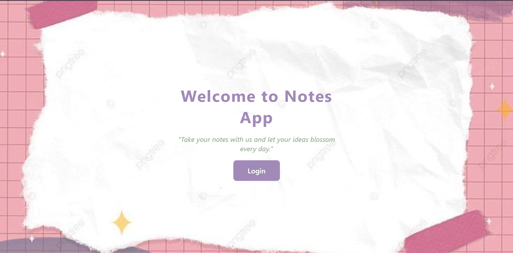

# Notes App

A modern, user-friendly note-taking web application built with Django.

## Features
- User registration and login
- Add, edit, delete notes
- Pin/unpin and archive/unarchive notes
- Color-coded notes and tag support
- Filter notes by tag, pinned, or archived status
- Responsive, beautiful UI with dashboard and stats

## Usage
- Register a new user or log in.
- Add notes with title, content, tag, and color.
- Pin/unpin and archive/unarchive notes from the "My Notes" page.
- Edit or delete notes as needed.
- Filter notes by tag, pinned, or archived using the filter bar.

## Project Structure
- `core/` - Django app with models, views, and URLs
- `templates/` - HTML templates for all pages
- `static/` - Static files (images, CSS backgrounds)
- `db.sqlite3` - SQLite database (default)
